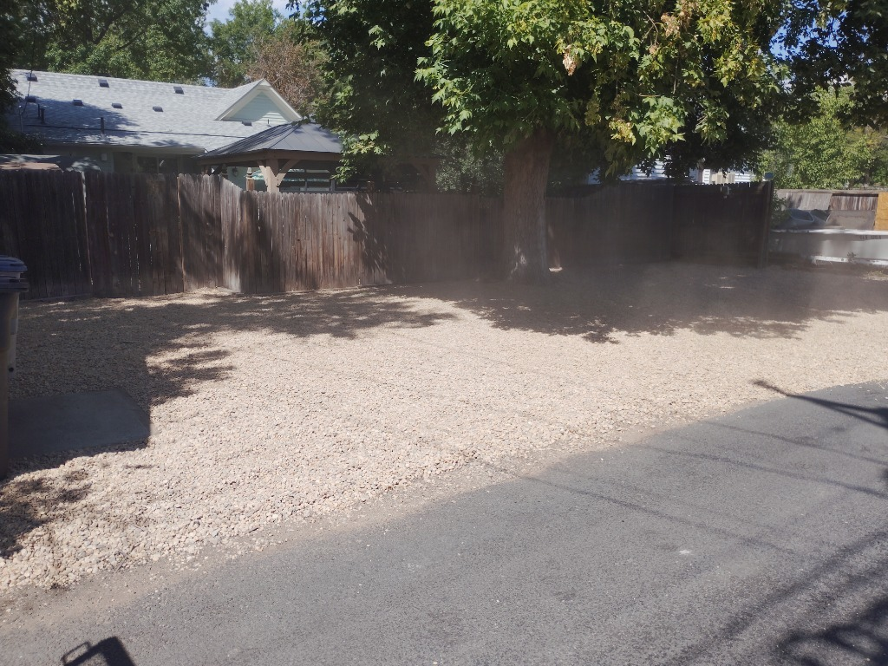

# Groundwork Outdoor Co. - Site Improvement Plan

Based on the site audit, here are recommended improvements prioritized by impact:

## 🚀 High Impact Improvements

### 1. Add Mobile Navigation JavaScript
**Problem**: Mobile menu button exists but isn't functional
**Solution**: Add simple toggle functionality

```javascript
// Add to a new file: assets/js/main.js or inline in footer
document.addEventListener('DOMContentLoaded', function() {
  const navToggle = document.getElementById('nav-toggle');
  const navMobilePanel = document.getElementById('nav-mobile-panel');
  
  if (navToggle && navMobilePanel) {
    navToggle.addEventListener('click', function() {
      const isOpen = navToggle.getAttribute('aria-expanded') === 'true';
      navToggle.setAttribute('aria-expanded', String(!isOpen));
      navMobilePanel.classList.toggle('open', !isOpen);
    });
    
    // Close mobile menu when clicking a link
    const mobileLinks = navMobilePanel.querySelectorAll('a');
    mobileLinks.forEach(link => {
      link.addEventListener('click', () => {
        navToggle.setAttribute('aria-expanded', 'false');
        navMobilePanel.classList.remove('open');
      });
    });
  }
});
```

**CSS addition needed**:
```css
.nav-mobile-panel {
  display: none;
  position: fixed;
  top: 0;
  right: 0;
  height: 100vh;
  width: 280px;
  background: var(--bg-panel);
  padding: 80px 32px 32px;
  box-shadow: -4px 0 12px rgba(0,0,0,0.3);
  z-index: 1000;
  flex-direction: column;
}

.nav-mobile-panel.open {
  display: flex;
}

.nav-mobile-panel a {
  padding: 16px 0;
  border-bottom: 1px solid var(--line);
  font-size: 18px;
}
```

### 2. Add Image Alt Text for Accessibility & SEO
**Problem**: Many images lack descriptive alt attributes
**Solution**: Add meaningful alt text to all images

Examples:
```html
<!-- Before -->


<!-- After -->

```

### 3. Implement Netlify Forms for Better Form Handling
**Problem**: Using Formspree external service
**Solution**: Switch to Netlify's built-in form handling

Changes needed in contact.html:
```html
<!-- Change form tag from -->
<form action="https://formspree.io/f/mjyvregb" method="POST">

<!-- To Netlify form -->
<form name="contact" method="POST" data-netlify="true">
  <input type="hidden" name="form-name" value="contact">
  <!-- Netlify will automatically detect and process this -->
</form>
```

Then enable forms in Netlify dashboard Site Settings > Forms

## 🔧 Medium Impact Improvements

### 4. Add Lazy Loading to Images
**Problem**: All images load immediately impacting initial load time
**Solution**: Add loading="lazy" to below-the-fold images

```html
<!-- Add to images not in initial viewport -->

```

### 5. Consolidate Duplicate CSS
**Problem**: Each HTML file duplicates the same CSS (~1KB each)
**Solution**: Extract common CSS to external stylesheet

Create `assets/css/main.css` with shared variables and styles, then:
```html
<link rel="stylesheet" href="assets/css/main.css">
```

### 6. Add Structured Data Improvements
**Problem**: Schema data uses placeholder information
**Solution**: Update with real business information

Update the JSON-LD in each file with actual:
- Business name
- Real address  
- Real phone number
- Actual opening hours
- Real images/logo

### 7. Add Smooth Scroll Polyfill for Better Compatibility
**Problem**: scroll-behavior:smooth may not work in all browsers
**Solution**: Add lightweight polyfill or use CSS-only solution

## 💡 Low Impact but Nice-to-Have

### 8. Add Favicon and App Icons
Create favicon.ico and various size icons for better branding

### 9. Add Social Meta Tags
Enhance Open Graph and Twitter Card sharing:
```html
<meta name="twitter:card" content="summary_large_image">
<meta name="twitter:site" content="@groundworkco">
```

### 10. Add 404 Page
Create a custom 404.html page for better UX on broken links

### 11. Add Site Search (Simple)
For larger sites, consider adding a simple search functionality

## 📱 Mobile-Specific Improvements

### 12. Improve Touch Targets
Ensure all tappable elements are at least 44x44px

### 13. Add Viewport Meta Enhancement
Consider adding:
```html
<meta name="viewport" content="width=device-width, initial-scale=1.0, maximum-scale=5.0">
```

## ⚡ Performance Improvements

### 14. Preload Critical Resources
```html
<link rel="preload" href="https://fonts.googleapis.com/css2?family=Fraunces:opsz,wght@9..144,340;9..144,460;9..144,560&family=Work+Sans:wght@400;500;600&display=swap" as="style">
<link rel="preconnect" href="https://fonts.gstatic.com" crossorigin>
```

### 15. Add HTTP Headers via _headers file
Create `_headers` file for Netlify:
```
/*
  X-Content-Type-Options: nosniff
  X-Frame-Options: DENY
  Referrer-Policy: strict-origin-when-cross-origin
```
